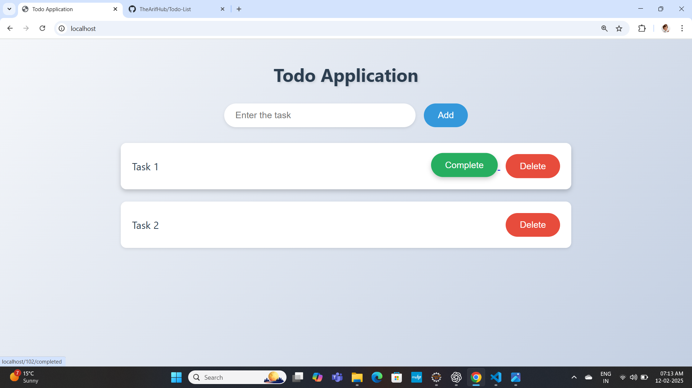

# 📋 To-Do Application  
A simple To-Do application built using **Spring Boot, Thymeleaf, and JPA** that allows users to add, complete, and delete tasks.

## 🚀 Features  
✅ Add new tasks  
✅ Mark tasks as completed  
✅ Delete tasks  
✅ Responsive UI with modern design  

## 🛠️ Technologies Used  
- **Backend:** Spring Boot, Spring MVC, JPA (Hibernate)  
- **Frontend:** HTML, CSS, Thymeleaf  
- **Database:** MySQL  
- **Build Tool:** Maven  

## 📂 Project Structure  
```
📦 todo-application  
 ┣ 📂 src  
 ┃ ┣ 📂 main  
 ┃ ┃ ┣ 📂 java/com/todo/todo_application  
 ┃ ┃ ┃ ┣ 📜 TodoApplication.java  
 ┃ ┃ ┃ ┣ 📂 controller  
 ┃ ┃ ┃ ┃ ┣ 📜 MyController.java  
 ┃ ┃ ┃ ┣ 📂 dto  
 ┃ ┃ ┃ ┃ ┣ 📜 Task.java  
 ┃ ┃ ┃ ┣ 📂 repository  
 ┃ ┃ ┃ ┃ ┣ 📜 TaskRepository.java  
 ┃ ┃ ┃ ┣ 📂 service  
 ┃ ┃ ┃ ┃ ┣ 📜 TaskService.java  
 ┃ ┃ ┣ 📂 resources/templates  
 ┃ ┃ ┃ ┣ 📜 home.html  
 ┃ ┃ ┣ 📂 static/css  
 ┃ ┃ ┃ ┣ 📜 home.css  
 ┣ 📜 pom.xml  
 ┣ 📜 README.md  
```

## 🏗️ Installation and Setup  
1️⃣ **Clone the Repository:**  
```bash
git clone https://github.com/your-username/todo-application.git
cd todo-application
```

2️⃣ **Build the project using Maven:**  
```bash
mvn clean install
```

3️⃣ **Run the application:**  
```bash
mvn spring-boot:run
```

4️⃣ **Open the application in the browser:**  
```
http://localhost:8080
```

## 🔧 API Endpoints  
| Method  | Endpoint            | Description            |
|---------|---------------------|------------------------|
| `GET`   | `/`                 | Load home page        |
| `POST`  | `/`                 | Add a new task        |
| `GET`   | `/{id}/completed`   | Mark task as complete |
| `GET`   | `/{id}/delete`      | Delete a task         |

## 🎨 UI Preview  


## 🏆 Contributing  
Feel free to fork this project and contribute!  
1. Fork the repository  
2. Create a new branch (`git checkout -b feature-name`)  
3. Commit your changes (`git commit -m "Added new feature"`)  
4. Push to your branch (`git push origin feature-name`)  
5. Create a Pull Request  

---

🔹 **Author:** Mohammed Arifulla  
🔹 **GitHub:** [TheArifHub](https://github.com/TheArifHub)  

Hope this helps! Let me know if you need modifications. 🚀
